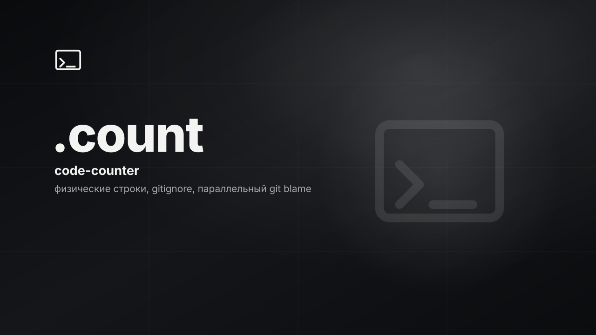

# .count

<p>
  
  
  
  <!-- loc:start --><!-- loc:end -->
</p>



Python-библиотека и CLI для подсчёта физических строк кода в каталоге. Учитывает `.gitignore`, группирует по расширениям, опционально считает вклад авторов через `git blame --incremental`. Runtime - только stdlib; внешние pip-зависимости не нужны.

## Запуск

PyPI:

```bash
pip install code-counter-ntwusr
code-counter .
```

Из исходников:

```bash
pip install -e ".[dev]"
code-counter .
```

### API

```python
from code_counter import analyze_project, CodeCounter, Analysis

analysis = analyze_project(".", as_json=False)  # печатает отчёт и возвращает Analysis
counter = CodeCounter(".")
result = counter.analyze(with_author=True, jobs=4)
total = result.total_lines
```

Публичный API: `CodeCounter`, `GitIgnoreParser`, `Analysis`, `analyze_project()` (`__all__` в `code_counter.py`).

## Команды

| Команда | Назначение |
|---------|------------|
| `code-counter [path]` | Анализ каталога (default: `.`) |
| `code-counter -f` / `--files` | Показать крупнейшие файлы |
| `code-counter -n N` / `--top N` | Сколько файлов в топе (default: 10) |
| `code-counter --no-blame` | Без статистики по авторам |
| `code-counter --all-text` | Любые текстовые файлы, не только code extensions |
| `code-counter --ext .foo .bar` | Добавить расширения к дефолтному списку |
| `code-counter -j N` / `--jobs N` | Worker-потоки для git blame |
| `code-counter --json` | Вывод `Analysis.to_dict()` в stdout |
| `code-counter -v` / `--version` | Версия (`code_counter.__version__`, сейчас 0.2.0) |
| `pytest` | Тесты (`tests/`, `testpaths` в `pyproject.toml`) |
| `ruff check .` | Lint (`line-length = 100`, `py312`) |
| `mypy code_counter.py` | Typecheck (dev dependency) |

Entry point: `[project.scripts]` → `code-counter = code_counter:main`.

## Стек

<p>
  
  
  
  
  
  
</p>

## Тесты

```bash
pytest
```

## Архитектура

Один модуль `code_counter.py`: парсер `.gitignore`, обход каталога, подсчёт строк в бинарном режиме, git blame через `ThreadPoolExecutor`. CLI - `argparse` в `main()`.

```
code-counter/
├── code_counter.py              # GitIgnoreParser, CodeCounter, CLI (v0.2.0)
├── pyproject.toml               # setuptools, entry point, ruff/pytest/mypy
├── conftest.py                  # делает плоский модуль импортируемым из тестов
├── AGENTS.md                    # инструкции для coding-агентов
├── CLAUDE.md                    # обёртка → AGENTS.md
├── .cursor/rules/
│   └── dotcore-project.mdc
├── docs/
│   └── cover.svg
└── tests/
    ├── test_counter.py
    └── test_gitignore.py
```

- **Физические строки**: подсчёт по `\n` в бинарном чтении, не AST и не logical LOC
- **gitignore**: wildcards, `**`, якоря, directory-only (`/`), negation (`!`)
- **Расширения**: 129 suffix + 9 имён файлов (Makefile, Dockerfile…); override через `--all-text` / `--ext`
- **Author stats**: `git blame --incremental`, параллельно по файлам; без `.git` или git в PATH - пропуск без ошибки
- **Публикация**: PyPI `code-counter-ntwusr`, runtime deps = stdlib

## Лицензия

MIT. Свободное использование, копирование, изменение и распространение с сохранением копирайта и текста лицензии. См. [LICENSE](LICENSE).
